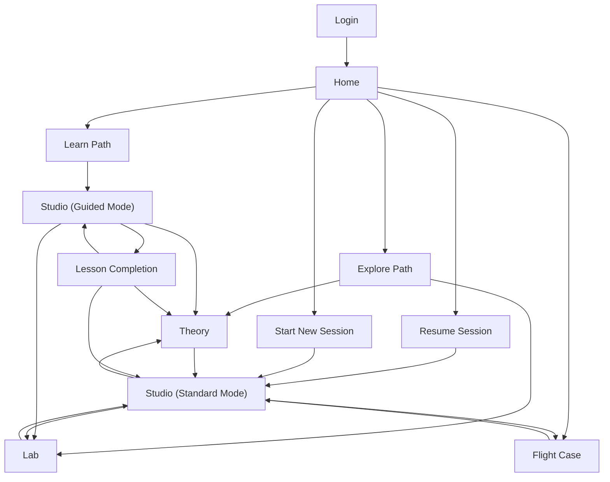
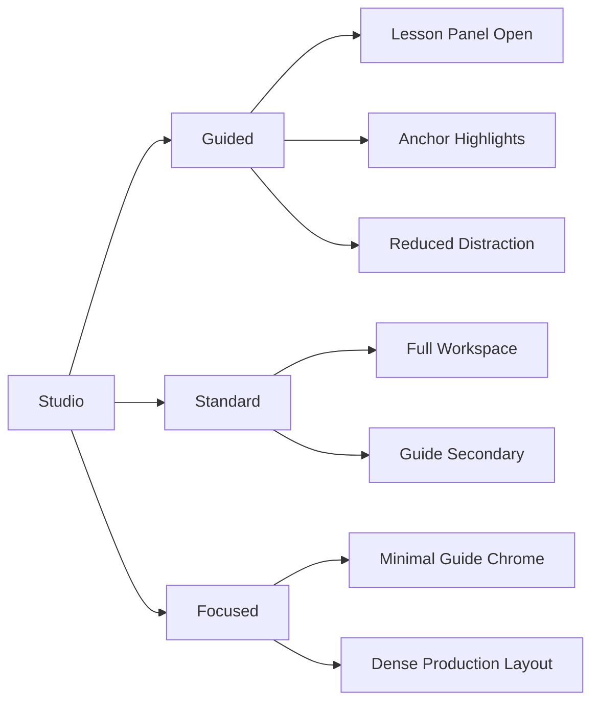
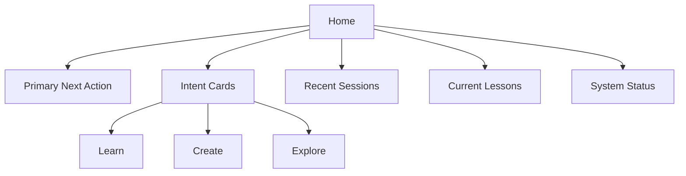
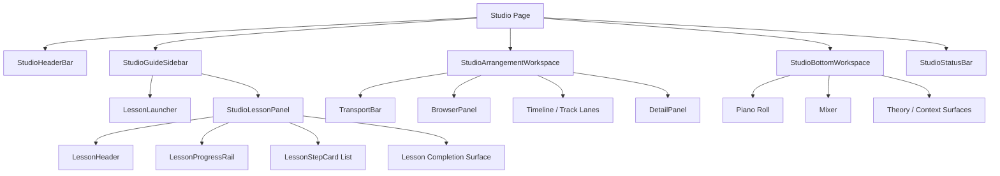
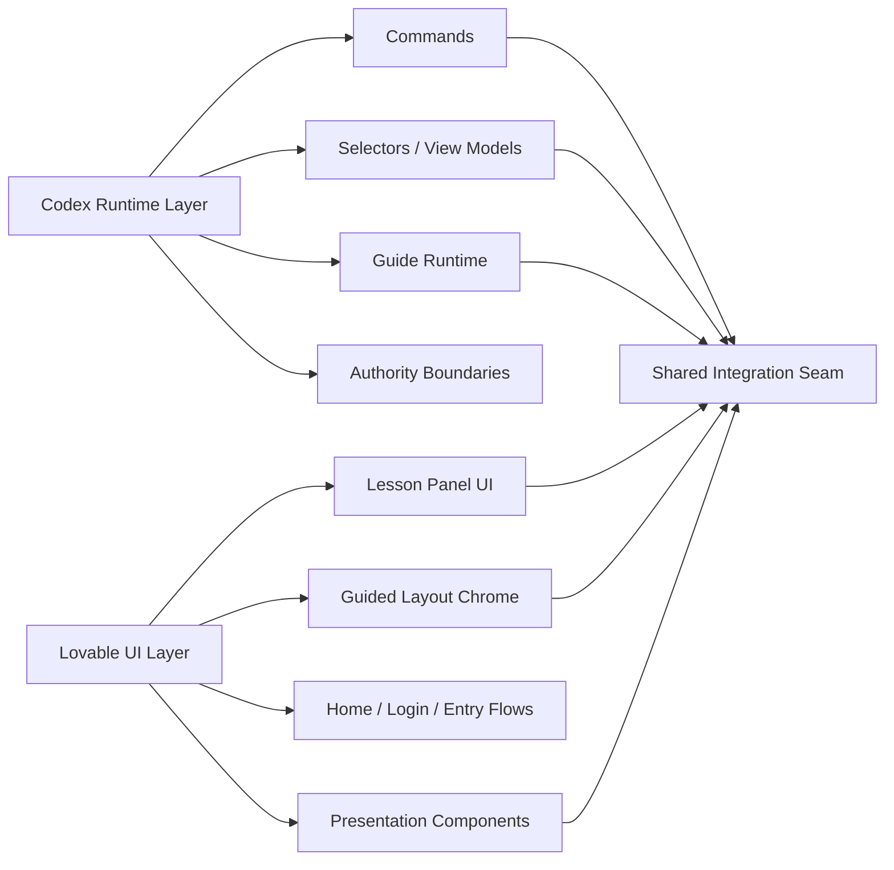

# MusicHub UX Diagrams v1

## Page And State Transition Diagram

```mermaid
flowchart TD
    A["Login"] --> B["Home"]
    B --> C["Learn Path"]
    B --> D["Resume Session"]
    B --> E["Start New Session"]
    B --> F["Explore Path"]
    B --> G["Flight Case"]

    C --> H["Studio (Guided Mode)"]
    D --> I["Studio (Standard Mode)"]
    E --> I
    F --> J["Lab"]
    F --> K["Theory"]

    H --> K
    H --> J
    H --> L["Lesson Completion"]
    I --> J
    I --> K
    I --> G
    J --> I
    K --> I
    G --> I
    L --> H
    L --> K
    L --> I
```

## Studio Mode Diagram

```mermaid
flowchart LR
    A["Studio"] --> B["Guided"]
    A --> C["Standard"]
    A --> D["Focused"]

    B --> E["Lesson Panel Open"]
    B --> F["Anchor Highlights"]
    B --> G["Reduced Distraction"]

    C --> H["Full Workspace"]
    C --> I["Guide Secondary"]

    D --> J["Minimal Guide Chrome"]
    D --> K["Dense Production Layout"]
```

## Home Hierarchy

```mermaid
flowchart TD
    A["Home"] --> B["Primary Next Action"]
    A --> C["Intent Cards"]
    A --> D["Recent Sessions"]
    A --> E["Current Lessons"]
    A --> F["System Status"]

    C --> G["Learn"]
    C --> H["Create"]
    C --> I["Explore"]
```

## Guided Studio Component Hierarchy

```mermaid
flowchart TD
    A["Studio Page"] --> B["StudioHeaderBar"]
    A --> C["StudioGuideSidebar"]
    A --> D["StudioArrangementWorkspace"]
    A --> E["StudioBottomWorkspace"]
    A --> F["StudioStatusBar"]

    C --> G["LessonLauncher"]
    C --> H["StudioLessonPanel"]
    H --> I["LessonHeader"]
    H --> J["LessonProgressRail"]
    H --> K["LessonStepCard List"]
    H --> L["Lesson Completion Surface"]

    D --> M["TransportBar"]
    D --> N["BrowserPanel"]
    D --> O["Timeline / Track Lanes"]
    D --> P["DetailPanel"]

    E --> Q["Piano Roll"]
    E --> R["Mixer"]
    E --> S["Theory / Context Surfaces"]
```

## Responsibility Split Diagram

```mermaid
flowchart LR
    A["Codex Runtime Layer"] --> B["Commands"]
    A --> C["Selectors / View Models"]
    A --> D["Guide Runtime"]
    A --> E["Authority Boundaries"]

    F["Lovable UI Layer"] --> G["Lesson Panel UI"]
    F --> H["Guided Layout Chrome"]
    F --> I["Home / Login / Entry Flows"]
    F --> J["Presentation Components"]

    B --> K["Shared Integration Seam"]
    C --> K
    D --> K
    G --> K
    H --> K
    J --> K
```
